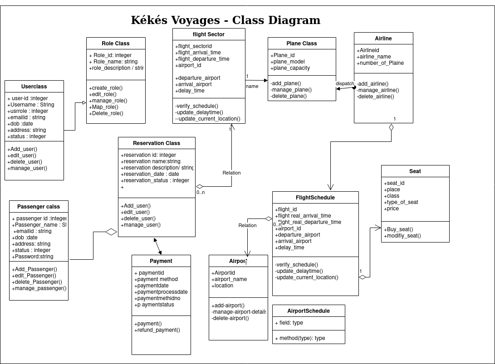

# Class Diagrams

 Class diagram is UML structure diagram which shows structure of the designed system at the level of classes and interfaces, shows their features, constraints and relationships - associations, generalizations, dependencies, etc.

Some common types of class diagrams are:

    domain model diagram,
    diagram of implementation classes.

Object diagram could be considered as instance level class diagram which shows instance specifications of classes and interfaces (objects), slots with value specifications, and links (instances of association). 

### Classdiagram page

 