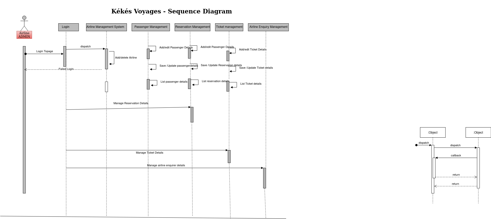

# UML Sequence Diagrams

 Sequence diagram is the most common kind of interaction diagram, which focuses on the message interchange between a number of lifelines.

Sequence diagram describes an interaction by focusing on the sequence of messages that are exchanged, along with their corresponding occurrence specifications on the lifelines.

The following nodes and edges are typically drawn in a UML sequence diagram: lifeline, execution specification, message, combined fragment, interaction use, state invariant, continuation, destruction occurrence. 

### Sequence page

 