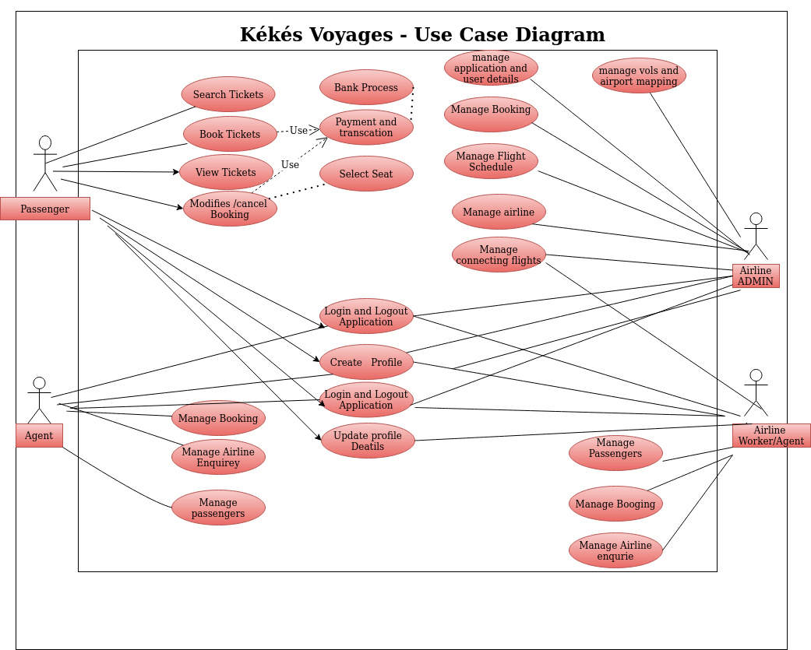

 # Use case Diagrams

Use case diagrams are usually referred to as behavior diagrams used to describe a set of actions (use cases) that some system or systems (subject) should or can perform in collaboration with one or more external users of the system (actors). Each use case should provide some observable and valuable result to the actors or other stakeholders of the system.

Note, that UML 2.0 to 2.4 specifications also described use case diagram as a specialization of a class diagram, and class diagram is a structure diagram.

Use case diagrams are in fact twofold - they are both behavior diagrams, because they describe behavior of the system, and they are also structure diagrams - as a special case of class diagrams where classifiers are restricted to be either actors or use cases related to each other with associations. 

 ####

 